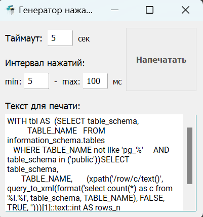

# Генератор нажатий клавиш по тексту 
Для переноса текста на RDP, где отключен буфер обмена.

# Требования
__Сборка__
1. ОС - Windows
2. Python 3.11

__Запуск исполняемого файла__
1. ОС - Windows

## Сборка
1. Установить зависимости
`
pip install -r requirements.txt
`
2. Собрать код в один исполняемый .exe файл
`
pyinstaller main.spec
`
## Использование
1. Соберите свой .exe файл, либо используйте уже готовый.
2. Запустите собранный исполняемый файл
`
./dist/Набиратель.exe
`
3. В появившемся окне введите текст, который нужно напечатать
4. Нажмите "Напечатать"
5. Нажмите на окно, куда будет печататься текст. 
6. Через указанный таймаут в секундах, начнется эмуляция
нажатий клавиш клавиатуры и набор текста. Необходимо выбрать поле, куда 
будет печататься текст, до окончания времени таймаута. Например, выбрать блокнот в RDP, куда запрещено копировать текст, т.к. отключен буфер обмена.
Интервал нажатий определяет задержку между нажатиями.

## License

MIT

